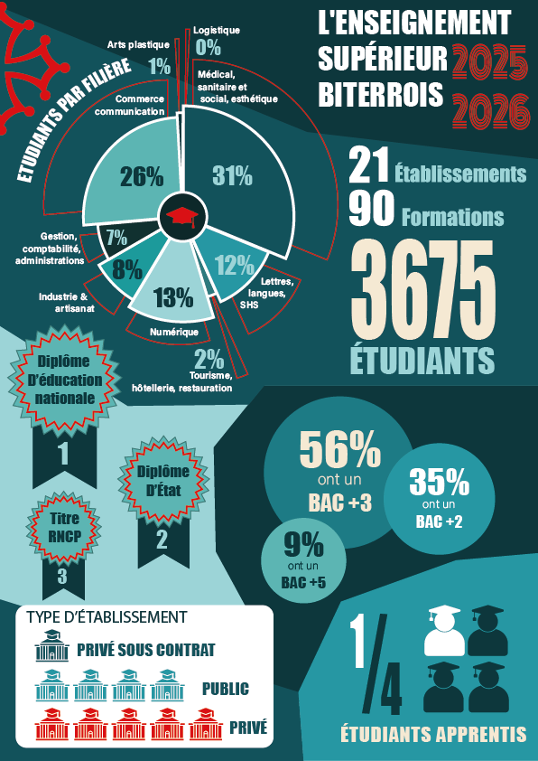

# SAE303 - Projet d'Infographie

Projet de réalité augmentée (AR) développé dans le cadre de la SAE 303.

Réalisé par : Lélia Cailhol - Rahim Tamhaev 

## Description

Ce projet utilise la technologie de réalité augmentée pour créer une expérience interactive basée sur la reconnaissance d'images. L'application utilise A-Frame et MindAR pour afficher des modèles 3D et des graphiques lorsque l'image cible est scannée.

## Image à scanner



## Installation

Clonez le projet :

```bash
git clone https://github.com/Armfy/SAE303.git
cd SAE303
```

## Technologies utilisées

- A-Frame
- MindAR
- WebGL
